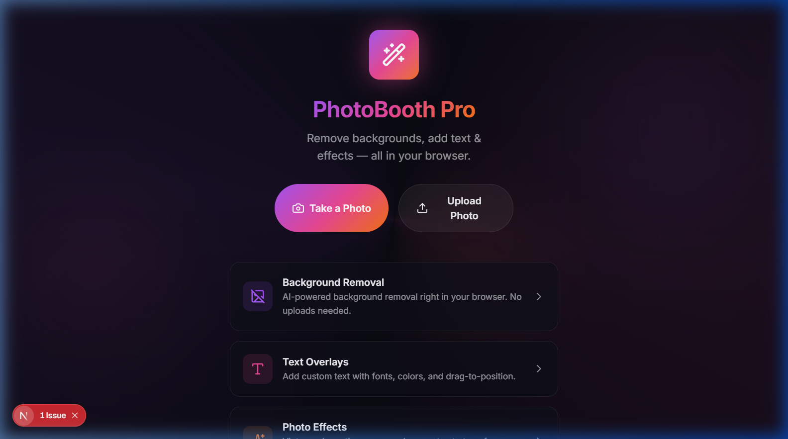

<p align="center">
  
</p>

<h1 align="center">📸 PhotoBooth Pro</h1>

<p align="center">
  <strong>Premium photo editor PWA with AI background removal, real-time camera filters, Dudu & Bubu stickers, text overlays, and stunning effects — all running entirely in your browser.</strong>
</p>

<p align="center">
  <a href="https://github.com/amirisback/photobooth/blob/master/LICENSE">
    
  </a>
  <a href="https://nextjs.org">
    
  </a>
  <a href="https://react.dev">
    
  </a>
  <a href="https://www.typescriptlang.org">
    
  </a>
  <a href="https://tailwindcss.com">
    
  </a>
</p>

---

## ✨ Features

| Feature | Description |
|---|---|
| 📷 **Live Camera** | Full-screen camera viewfinder with front/rear camera switching |
| 🎨 **14 Real-time Filters** | Normal, B&W, Sepia, Vintage, Warm, Cool, Dramatic, Bright, Fade, Noir, Vivid, Soft, Retro, Cinema |
| 🖼️ **Decorative Borders** | SVG-based border overlays rendered on the live viewfinder |
| 🐻 **264 Dudu & Bubu Stickers** | Animated GIF stickers organized into 4 categories: Bear (Dudu), Panda (Bubu), Couple, and Dudu & Bubu originals |
| ✂️ **AI Background Removal** | Client-side background removal powered by `@imgly/background-removal` — no server uploads needed |
| 🔤 **Text Overlays** | Drag-to-position text with customizable fonts, colors, and sizes |
| 🌈 **Photo Effects** | Post-capture effects for additional photo editing |
| 📤 **Export & Download** | Save your edited photos in multiple formats |
| 📱 **PWA (Installable)** | Install as a native app on Android & iOS via Serwist service worker |
| 🌙 **Dark Mode Design** | Premium glassmorphism UI with animated gradient backgrounds |

---

## 🚀 Tech Stack

- **Framework:** [Next.js 16](https://nextjs.org) (App Router, Webpack)
- **UI:** [React 19](https://react.dev) + [TypeScript 5](https://www.typescriptlang.org)
- **Styling:** [Tailwind CSS 4](https://tailwindcss.com) + Custom CSS Design System
- **Icons:** [Lucide React](https://lucide.dev)
- **AI:** [@imgly/background-removal](https://img.ly) — runs in-browser via WebAssembly
- **PWA:** [Serwist](https://serwist.pages.dev) (Service Worker for offline support)
- **Font:** [Inter](https://fonts.google.com/specimen/Inter) via `next/font`
- **Stickers:** [Dudu & Bubu Collection](https://github.com/amirisback/photo-panda-bear-dudu-bubu)

---

## 🏗️ Project Structure

```
photobooth/
├── app/
│   ├── camera/
│   │   └── page.tsx          # Full-screen camera with filters, borders & stickers
│   ├── editor/
│   │   ├── page.tsx          # Photo editor (background removal, text, effects)
│   │   └── components/
│   │       ├── BackgroundPanel.tsx
│   │       ├── CanvasPreview.tsx
│   │       ├── EffectsPanel.tsx
│   │       ├── ExportDialog.tsx
│   │       ├── TextPanel.tsx
│   │       └── ToolBar.tsx
│   ├── hooks/
│   │   ├── use-camera.ts     # Camera access & capture hook
│   │   └── use-photo-editor.ts # Editor state management hook
│   ├── lib/
│   │   ├── border-overlays.ts # SVG border definitions
│   │   ├── canvas-utils.ts    # Canvas export utilities
│   │   ├── sticker-defs.ts    # 264 Dudu & Bubu sticker definitions
│   │   └── types.ts           # Shared TypeScript types
│   ├── globals.css            # Design system (glassmorphism, animations, buttons)
│   ├── layout.tsx             # Root layout with Inter font & PWA metadata
│   ├── manifest.ts            # PWA Web App Manifest
│   ├── page.tsx               # Landing page with hero & feature cards
│   └── sw.ts                  # Service worker source
├── public/
│   └── stickers/              # 264 animated GIF stickers
│       ├── bear-*.gif         # Bear (Dudu) stickers
│       ├── panda-*.gif        # Panda (Bubu) stickers
│       ├── bubu-*.gif         # Bubu originals
│       ├── dudu-*.gif         # Dudu originals
│       └── couple/            # Couple stickers
├── docs/
│   └── screenshots/           # App screenshots for README
├── package.json
├── next.config.ts             # Next.js + Serwist config
└── tsconfig.json
```

---

## 🛠️ Getting Started

### Prerequisites

- **Node.js** >= 18
- **npm** >= 9

### Installation

```bash
# Clone the repository
git clone https://github.com/amirisback/photobooth.git
cd photobooth

# Install dependencies
npm install

# Start development server
npm run dev
```

Open [http://localhost:3000](http://localhost:3000) in your browser.

### Build for Production

```bash
npm run build
npm start
```

---

## 📱 How to Use

1. **Take a Photo** — Tap "Take a Photo" to open the full-screen camera
2. **Apply Filters** — Swipe through 14 real-time camera filters
3. **Add Borders** — Switch to the Borders tab for decorative frame overlays
4. **Place Stickers** — Browse 264 Dudu & Bubu GIF stickers, tap to place, drag to reposition
5. **Capture** — Press the shutter button to capture with all overlays applied
6. **Edit** — Use the editor for background removal, text overlays, and effects
7. **Export** — Download your finished photo

---

## 🎨 Design System

The app features a premium dark mode design with:

- **Glassmorphism** cards with `backdrop-filter: blur(20px)`
- **Gradient accents** — Purple (`#a855f7`) → Pink (`#ec4899`) → Orange (`#f97316`)
- **Smooth animations** — fadeIn, slideUp, pulseGlow, float, shimmer
- **Safe area support** — Proper padding for notched devices (iPhone, etc.)
- **Touch-optimized** — 48px minimum touch targets, `-webkit-tap-highlight-color: transparent`

---

## 🐻 Sticker Collection

264 animated GIF stickers from the [Dudu & Bubu](https://github.com/amirisback/photo-panda-bear-dudu-bubu) collection:

| Category | Count | Description |
|---|---|---|
| 🐻 Bear (Dudu) | 120+ | Solo bear character stickers |
| 🐼 Panda (Bubu) | 33+ | Solo panda character stickers |
| 💕 Couple | 100+ | Bear & Panda together stickers |
| 🎭 Dudu & Bubu | 5 | Original character stickers |

---

## 📄 License

```
Copyright 2026 Muhammad Faisal Amir

Licensed under the Apache License, Version 2.0 (the "License");
you may not use this file except in compliance with the License.
You may obtain a copy of the License at

    http://www.apache.org/licenses/LICENSE-2.0

Unless required by applicable law or agreed to in writing, software
distributed under the License is distributed on an "AS IS" BASIS,
WITHOUT WARRANTIES OR CONDITIONS OF ANY KIND, either express or implied.
See the License for the specific language governing permissions and
limitations under the License.
```

---

## 🤝 Contributing

Contributions are welcome! Please read the [Code of Conduct](CODE_OF_CONDUCT.md) and [Security Policy](SECURITY.md) before contributing.

1. Fork the repository
2. Create your feature branch (`git checkout -b feature/amazing-feature`)
3. Commit your changes (`git commit -m 'Add amazing feature'`)
4. Push to the branch (`git push origin feature/amazing-feature`)
5. Open a Pull Request

---

<p align="center">
  Made with ❤️ by <a href="https://github.com/amirisback">Muhammad Faisal Amir</a>
</p>
