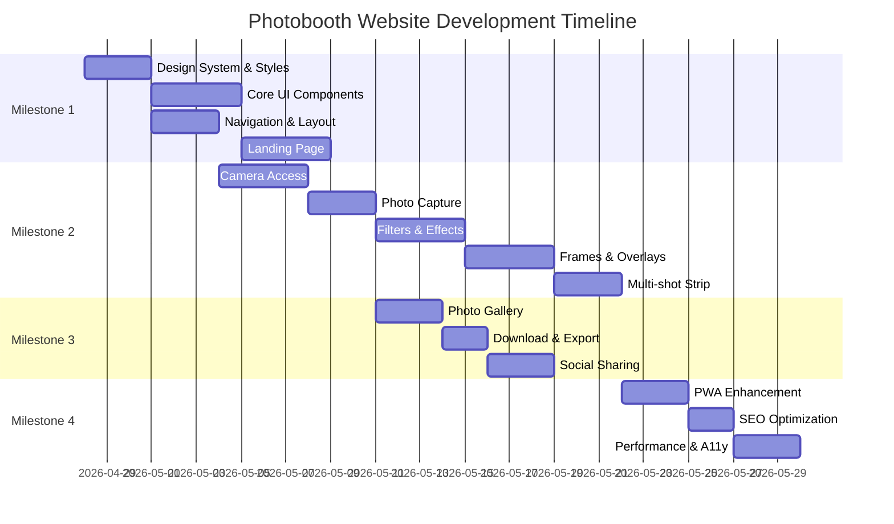

# 📋 Photobooth Website — Product Planning & GitHub Issues

## Project Overview

**Project**: Photobooth Website  
**Repo**: [amirisback/photoboth](https://github.com/amirisback/photoboth)  
**Tech Stack**: Next.js 16, React 19, TypeScript, TailwindCSS v4, Serwist (PWA)  
**Design System**: Vodafone-inspired (documented in `DESIGN.md`)

## Project Vision

Membangun website photobooth interaktif yang memungkinkan pengguna untuk mengambil foto menggunakan kamera perangkat, menerapkan filter/efek, menambahkan frame/stiker, dan mengunduh/membagikan hasil foto mereka. Website ini dirancang dengan desain premium terinspirasi dari Vodafone Design System.

## Current State

Project masih dalam tahap boilerplate Next.js — belum ada fitur photobooth yang diimplementasikan. Design system sudah didokumentasikan dengan detail di `DESIGN.md`. PWA support sudah dikonfigurasi via Serwist.

---

## Milestones

| # | Milestone | Deskripsi | Target |
|---|-----------|-----------|--------|
| 1 | 🏗️ Foundation & Design System | Setup komponen dasar, layout, dan design tokens | Sprint 1 |
| 2 | 📸 Core Photobooth Features | Kamera, filter, frame, capture | Sprint 2-3 |
| 3 | 🖼️ Gallery & Social Features | Galeri hasil foto, download, share | Sprint 4 |
| 4 | 🚀 Polish & Deployment | Performance, SEO, PWA, deploy | Sprint 5 |

---

## Issues Breakdown

### Milestone 1: Foundation & Design System

---

#### Issue #1: Setup Design System & Global Styles

**Labels**: `enhancement`, `good first issue`  
**Priority**: 🔴 Critical  
**Estimate**: 3-5 hours

**Deskripsi**:
Implementasi design system berdasarkan `DESIGN.md` ke dalam project. Termasuk setup font (Inter sebagai pengganti Vodafone typeface), color tokens, spacing system, dan CSS variables.

**Acceptance Criteria**:
- [ ] Setup Google Font Inter (weights: 300, 400, 600, 700, 800)
- [ ] Definisikan CSS custom properties untuk semua color tokens dari DESIGN.md
- [ ] Implementasi spacing scale (2px → 96px) sebagai CSS variables
- [ ] Setup border-radius scale tokens
- [ ] Implementasi dark mode support
- [ ] Buat `globals.css` dengan semua design tokens
- [ ] Pastikan typography hierarchy sesuai DESIGN.md (Display 144px → Micro 12px)

---

#### Issue #2: Build Core UI Components

**Labels**: `enhancement`  
**Priority**: 🔴 Critical  
**Estimate**: 5-8 hours

**Deskripsi**:
Buat komponen UI reusable berdasarkan component stylings di `DESIGN.md`. Komponen ini akan digunakan di seluruh aplikasi.

**Acceptance Criteria**:
- [ ] Button components (Primary Red Rectangle, Primary Red Pill, Ghost White Rectangle, Glass Pill, Content Ghost Pill, Icon Control Button)
- [ ] Card components (News/Editorial Card, Asymmetric Corner Card)
- [ ] Tag Pills / Badges (Outlined Red Pill, Filled Neutral Pill)
- [ ] Red Divider Band component
- [ ] Input & Form components
- [ ] Semua komponen responsive sesuai breakpoint system
- [ ] Komponen memiliki hover states dan micro-animations

---

#### Issue #3: Build Navigation & Layout Shell

**Labels**: `enhancement`  
**Priority**: 🔴 Critical  
**Estimate**: 3-5 hours

**Deskripsi**:
Implementasi navigation bar, footer, dan layout shell utama yang akan menjadi kerangka seluruh halaman website.

**Acceptance Criteria**:
- [ ] Top navigation bar (transparent on hero → solid white on scroll)
- [ ] Logo placement (left-aligned, 40×40px)
- [ ] Navigation links dengan responsive collapse (hamburger at ≤768px)
- [ ] Mobile full-width overlay menu
- [ ] Footer component (4-column grid, social links, legal)
- [ ] Root layout integration dengan `layout.tsx`
- [ ] Smooth scroll behavior
- [ ] Active page indicator pada navigation

---

#### Issue #4: Build Landing Page / Homepage

**Labels**: `enhancement`  
**Priority**: 🟡 High  
**Estimate**: 5-8 hours

**Deskripsi**:
Desain dan implementasi landing page yang memukau dengan hero section, fitur highlights, dan call-to-action untuk memulai photobooth.

**Acceptance Criteria**:
- [ ] Hero section dengan dark atmospheric background image
- [ ] Monumental uppercase headline (144px, weight 800, negative tracking)
- [ ] Primary CTA button "Mulai Photobooth" (Red Pill style)
- [ ] Red divider band setelah hero
- [ ] Feature highlights section (3 fitur utama dengan ikon)
- [ ] How-it-works section dengan step-by-step
- [ ] Testimonial / gallery preview section
- [ ] Responsive di semua breakpoint (Mobile → Wide)

---

### Milestone 2: Core Photobooth Features

---

#### Issue #5: Camera Access & Live Preview

**Labels**: `enhancement`  
**Priority**: 🔴 Critical  
**Estimate**: 5-8 hours

**Deskripsi**:
Implementasi akses kamera perangkat menggunakan Web API (MediaDevices/getUserMedia) dan tampilkan live preview di layar.

**Acceptance Criteria**:
- [ ] Request camera permission menggunakan `navigator.mediaDevices.getUserMedia`
- [ ] Live video preview pada canvas/video element
- [ ] Toggle front/rear camera (mobile)
- [ ] Camera permission handling (granted, denied, not available)
- [ ] Graceful fallback jika kamera tidak tersedia
- [ ] Mirror mode untuk selfie camera
- [ ] Responsive camera viewport (full-width pada mobile, centered pada desktop)
- [ ] Loading state saat kamera sedang diinisialisasi

---

#### Issue #6: Photo Capture & Preview

**Labels**: `enhancement`  
**Priority**: 🔴 Critical  
**Estimate**: 3-5 hours

**Deskripsi**:
Implementasi fitur capture foto dari live camera feed dan tampilkan preview hasil foto.

**Acceptance Criteria**:
- [ ] Tombol capture foto (Icon Control Button style, circular)
- [ ] Capture foto dari video stream ke canvas
- [ ] Flash effect animation saat capture
- [ ] Countdown timer (3, 2, 1) sebelum capture (opsional toggle)
- [ ] Preview hasil foto setelah capture
- [ ] Opsi "Retake" untuk mengulang foto
- [ ] Opsi "Continue" untuk lanjut ke editing
- [ ] Support high-resolution capture

---

#### Issue #7: Photo Filters & Effects

**Labels**: `enhancement`  
**Priority**: 🟡 High  
**Estimate**: 5-8 hours

**Deskripsi**:
Implementasi berbagai filter dan efek visual yang bisa diterapkan pada foto. Filter harus bisa di-preview secara real-time.

**Acceptance Criteria**:
- [ ] Minimal 8 filter preset (Grayscale, Sepia, Vintage, Warm, Cool, High Contrast, Blur Background, Vivid)
- [ ] Real-time filter preview pada live camera feed
- [ ] Filter selection UI (horizontal scrollable strip dengan thumbnail preview)
- [ ] CSS filter + Canvas filter implementation
- [ ] Filter intensity slider (0-100%)
- [ ] "No Filter" / Original option
- [ ] Smooth transition saat mengganti filter
- [ ] Filter diterapkan pada hasil capture final

---

#### Issue #8: Photo Frames & Overlays

**Labels**: `enhancement`  
**Priority**: 🟡 High  
**Estimate**: 5-8 hours

**Deskripsi**:
Implementasi berbagai pilihan frame dan overlay dekoratif yang bisa ditambahkan pada foto.

**Acceptance Criteria**:
- [ ] Minimal 6 frame template (Classic, Polaroid, Filmstrip, Vintage Border, Modern Minimal, Celebration)
- [ ] Frame selection UI dengan preview thumbnails
- [ ] Frame overlay rendering di atas foto (canvas compositing)
- [ ] Custom text overlay (nama, tanggal, pesan)
- [ ] Text styling options (font, size, color, position)
- [ ] Stiker/emoji overlay (drag & drop positioning)
- [ ] Frame aspect ratio handling (4:3, 1:1, 3:4, 16:9)
- [ ] Watermark/branding option

---

#### Issue #9: Multi-shot / Strip Mode

**Labels**: `enhancement`  
**Priority**: 🟢 Medium  
**Estimate**: 3-5 hours

**Deskripsi**:
Implementasi mode photo strip — mengambil beberapa foto berurutan dan menggabungkannya dalam satu strip layout (seperti photo booth asli).

**Acceptance Criteria**:
- [ ] Mode "Photo Strip" yang mengambil 3-4 foto berurutan
- [ ] Countdown otomatis antar foto (3 detik)
- [ ] Progress indicator menunjukkan foto ke-berapa
- [ ] Preview setiap foto setelah diambil
- [ ] Layout strip vertikal (photo booth klasik)
- [ ] Opsi untuk mengulang foto individual
- [ ] Final strip preview sebelum save
- [ ] Customizable jumlah foto (2-6)

---

### Milestone 3: Gallery & Social Features

---

#### Issue #10: Photo Gallery Page

**Labels**: `enhancement`  
**Priority**: 🟡 High  
**Estimate**: 3-5 hours

**Deskripsi**:
Buat halaman galeri yang menampilkan semua foto yang telah diambil selama sesi. Foto disimpan secara lokal menggunakan localStorage/IndexedDB.

**Acceptance Criteria**:
- [ ] Gallery page route (`/gallery`)
- [ ] Grid layout untuk menampilkan foto (responsive: 4-up → 2-up → 1-up)
- [ ] Foto disimpan di IndexedDB (support blob storage)
- [ ] Lightbox view saat klik foto
- [ ] Delete individual photo
- [ ] Clear all photos
- [ ] Empty state yang menarik jika belum ada foto
- [ ] Lazy loading untuk performa

---

#### Issue #11: Download & Export Photo

**Labels**: `enhancement`  
**Priority**: 🔴 Critical  
**Estimate**: 2-3 hours

**Deskripsi**:
Implementasi fitur download/export foto dengan berbagai format dan kualitas.

**Acceptance Criteria**:
- [ ] Download foto sebagai PNG (high quality)
- [ ] Download foto sebagai JPEG (compressed)
- [ ] Opsi kualitas (High, Medium, Low)
- [ ] Download photo strip sebagai single image
- [ ] Batch download semua foto dari galeri (ZIP)
- [ ] Custom filename dengan timestamp
- [ ] Download button yang jelas dan accessible

---

#### Issue #12: Social Media Sharing

**Labels**: `enhancement`  
**Priority**: 🟢 Medium  
**Estimate**: 3-5 hours

**Deskripsi**:
Implementasi fitur sharing foto ke berbagai platform social media dan messaging.

**Acceptance Criteria**:
- [ ] Web Share API integration (native sharing pada mobile)
- [ ] Share ke WhatsApp
- [ ] Share ke Instagram (copy to clipboard with guidance)
- [ ] Share ke Twitter/X
- [ ] Share ke Facebook
- [ ] Copy link to clipboard
- [ ] QR code generation untuk easy sharing
- [ ] Share UI modal dengan platform options
- [ ] Fallback untuk browser yang tidak support Web Share API

---

### Milestone 4: Polish & Deployment

---

#### Issue #13: PWA Enhancement & Offline Support

**Labels**: `enhancement`  
**Priority**: 🟡 High  
**Estimate**: 3-5 hours

**Deskripsi**:
Tingkatkan PWA capabilities agar website bisa digunakan secara offline dan terasa seperti native app.

**Acceptance Criteria**:
- [ ] Service worker caching strategy (app shell + dynamic content)
- [ ] Offline fallback page yang informatif
- [ ] App manifest lengkap (icons, splash screen, theme color)
- [ ] Install prompt / Add to Homescreen banner
- [ ] Background sync untuk pending operations
- [ ] Cache management (auto cleanup old caches)
- [ ] PWA audit score ≥ 90 di Lighthouse

---

#### Issue #14: SEO & Meta Tags Optimization

**Labels**: `enhancement`, `documentation`  
**Priority**: 🟡 High  
**Estimate**: 2-3 hours

**Deskripsi**:
Optimasi SEO untuk semua halaman website agar mudah ditemukan di search engines.

**Acceptance Criteria**:
- [ ] Proper title tags untuk setiap halaman
- [ ] Meta descriptions yang compelling
- [ ] Open Graph tags (og:title, og:description, og:image)
- [ ] Twitter Card meta tags
- [ ] Structured data (JSON-LD) untuk WebApplication schema
- [ ] Sitemap.xml generation
- [ ] robots.txt configuration
- [ ] Canonical URLs
- [ ] Heading hierarchy (single H1 per page)

---

#### Issue #15: Performance Optimization & Accessibility

**Labels**: `enhancement`  
**Priority**: 🟡 High  
**Estimate**: 3-5 hours

**Deskripsi**:
Optimasi performa website dan pastikan accessibility standards terpenuhi.

**Acceptance Criteria**:
- [ ] Lighthouse Performance score ≥ 90
- [ ] Lighthouse Accessibility score ≥ 90
- [ ] Image optimization (next/image, WebP format)
- [ ] Code splitting & lazy loading
- [ ] Keyboard navigation support
- [ ] ARIA labels pada semua interactive elements
- [ ] Focus management yang proper
- [ ] Color contrast compliance (WCAG AA)
- [ ] Screen reader friendly
- [ ] Loading skeleton / placeholder states

---

## Issue Priority Matrix

| Priority | Issues | Deskripsi |
|----------|--------|-----------|
| 🔴 Critical | #1, #2, #3, #5, #6, #11 | Must-have untuk MVP, blocking other work |
| 🟡 High | #4, #7, #8, #10, #13, #14, #15 | Important for complete experience |
| 🟢 Medium | #9, #12 | Nice-to-have, can be deferred |

## Execution Plan

## Verification Plan

### Setelah setiap milestone:
1. **Lighthouse Audit** — Performance, Accessibility, SEO, PWA scores
2. **Cross-browser testing** — Chrome, Firefox, Safari, Edge
3. **Responsive testing** — Mobile (375px), Tablet (768px), Desktop (1440px)
4. **Camera testing** — Di berbagai perangkat (iOS Safari, Android Chrome)

> [!IMPORTANT]
> Semua 15 issues di atas akan di-upload ke GitHub sebagai individual issues menggunakan GitHub CLI (`gh issue create`). Setiap issue akan memiliki label, dan body yang terformat dengan baik.

## Open Questions

> [!IMPORTANT]
> 1. **Custom domain**: Apakah sudah ada domain untuk deployment?
> 2. **Branding**: Apakah nama brand/logo photobooth sudah ditentukan, atau menggunakan desain dari DESIGN.md as-is?
> 3. **Backend**: Apakah perlu server-side storage (database) untuk foto, atau cukup client-side saja (IndexedDB)?
> 4. **Analytics**: Apakah perlu integrasi analytics (Google Analytics, Vercel Analytics)?
