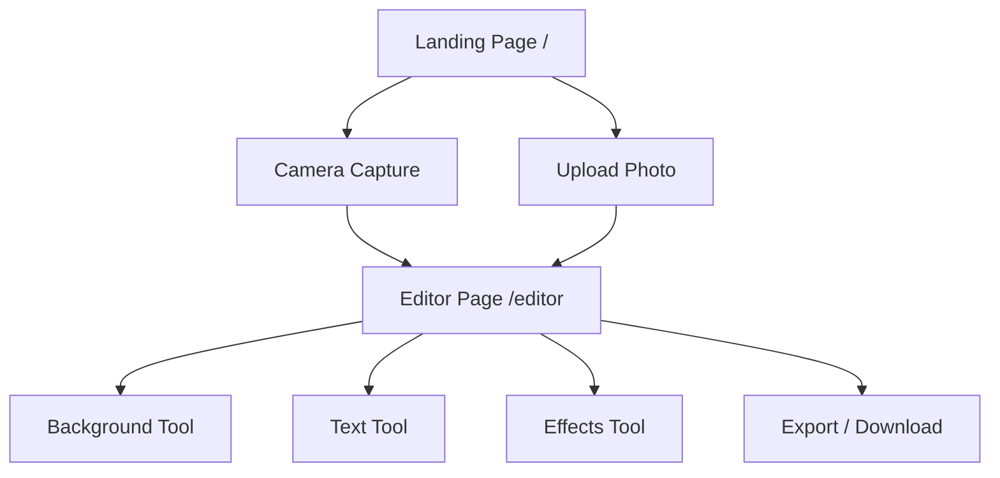

# Photobooth Web Application

Build a premium photobooth PWA with background replacement, text overlay, and visual effects — optimized for Android & iOS mobile browsers.

## Tech Stack

| Layer | Technology |
|-------|-----------|
| Framework | Next.js 16 (App Router, `--webpack` mode) |
| Styling | Tailwind CSS v4 |
| Language | TypeScript 5 |
| PWA | Serwist (already configured) |
| Image Processing | Canvas API + client-side JS (zero server deps) |
| Background Removal | `@imgly/background-removal` (TensorFlow.js WASM, runs 100% in-browser) |

## Architecture



All image processing happens **client-side** using Canvas API — no server uploads, no API keys, instant preview.

---

## Proposed Changes

### 1. Dependencies

#### [MODIFY] [package.json](file:///d:/WebstormProjects/photobooth/package.json)

Add required dependencies:

- `@imgly/background-removal` — WASM-based background removal (runs entirely in browser)
- `html2canvas` — for final composite export
- `lucide-react` — premium icon set

---

### 2. Global Design System

#### [MODIFY] [globals.css](file:///d:/WebstormProjects/photobooth/app/globals.css)

Complete redesign with:

- Dark-first color palette with vibrant accent gradients (purple → pink → orange)
- Glassmorphism design tokens (`backdrop-blur`, translucent surfaces)
- Custom animation keyframes (fade-in, slide-up, pulse-glow, shimmer)
- Touch-optimized base styles (48px minimum tap targets, smooth scrolling)
- Custom scrollbar styling
- TailwindCSS v4 `@theme inline` tokens for colors, spacing, and typography

#### [MODIFY] [layout.tsx](file:///d:/WebstormProjects/photobooth/app/layout.tsx)

- Update metadata: title → "PhotoBooth Pro", proper description and SEO
- Add `Inter` font from Google Fonts (replace Geist)
- Set viewport for mobile: `width=device-width, initial-scale=1, maximum-scale=1, user-scalable=no`
- Dark mode by default
- Apple Web App meta tags for iOS full-screen PWA

#### [MODIFY] [manifest.ts](file:///d:/WebstormProjects/photobooth/app/manifest.ts)

- Update name → "PhotoBooth Pro"
- Update theme colors to match new dark gradient design
- Add orientation: portrait

---

### 3. Landing Page (Home)

#### [MODIFY] [page.tsx](file:///d:/WebstormProjects/photobooth/app/page.tsx)

Premium landing page with:

- Hero section with animated gradient background and floating particles
- "Take a Photo" button → triggers camera via MediaDevices API
- "Upload Photo" button → triggers file input
- Feature showcase cards (background removal, text, effects)
- Glassmorphism card design with hover micro-animations
- Mobile-first responsive layout
- Camera/upload handlers that navigate to `/editor?source=camera|upload`

---

### 4. Core Types & Utilities

#### [NEW] [types.ts](file:///d:/WebstormProjects/photobooth/app/lib/types.ts)

Shared TypeScript interfaces:

```typescript
interface PhotoState {
  originalImage: string | null      // base64 data URL
  processedImage: string | null     // after bg removal
  backgroundImage: string | null    // chosen background
  backgroundColor: string           // solid color fallback
  texts: TextOverlay[]
  activeEffect: EffectType
}

interface TextOverlay {
  id: string
  content: string
  x: number; y: number
  fontSize: number
  fontFamily: string
  color: string
  rotation: number
  bold: boolean
  italic: boolean
}

type EffectType = 'none' | 'grayscale' | 'sepia' | 'vintage' | 'warm' | 'cool' | 'dramatic' | 'blur-bg' | 'vignette'

type EditorTool = 'background' | 'text' | 'effects' | null
```

#### [NEW] [canvas-utils.ts](file:///d:/WebstormProjects/photobooth/app/lib/canvas-utils.ts)

Pure utility functions for Canvas operations:

- `applyEffect(canvas, effect)` — CSS filter string mapping for each effect type
- `renderComposite(state)` — composites background + subject + text + effect → final canvas
- `exportAsDataURL(canvas, format, quality)` — export to PNG/JPEG
- `drawTextOverlay(ctx, text)` — renders styled text with shadow/outline

#### [NEW] [use-camera.ts](file:///d:/WebstormProjects/photobooth/app/hooks/use-camera.ts)

Custom hook for camera access:

- `startCamera(facingMode)` — request `getUserMedia` with constraints
- `captureFrame()` — capture current video frame to canvas → data URL
- `switchCamera()` — toggle front/rear
- `stopCamera()` — cleanup streams
- Handle permission denied gracefully with user-friendly messages
- Detect iOS Safari quirks (`playsinline` attribute)

#### [NEW] [use-photo-editor.ts](file:///d:/WebstormProjects/photobooth/app/hooks/use-photo-editor.ts)

Main editor state hook using `useReducer`:

- Manages full `PhotoState`
- Actions: `SET_IMAGE`, `SET_BACKGROUND`, `ADD_TEXT`, `UPDATE_TEXT`, `DELETE_TEXT`, `SET_EFFECT`, `RESET`
- Derived state: `isProcessing`, `canExport`, `hasChanges`

---

### 5. Editor Page

#### [NEW] [page.tsx](file:///d:/WebstormProjects/photobooth/app/editor/page.tsx)

Main editor layout (client component):

- Full-screen mobile-optimized layout
- Top toolbar: back button, undo, export
- Center: Canvas preview area (touch-responsive, pinch-to-zoom ready)
- Bottom: Tool selector tabs (Background, Text, Effects)
- Tool panels slide up from bottom (sheet-style, mobile UX pattern)

---

### 6. Editor Components

#### [NEW] [CanvasPreview.tsx](file:///d:/WebstormProjects/photobooth/app/editor/components/CanvasPreview.tsx)

Real-time canvas preview:

- Renders composite of background + subject + text overlays + effects
- Touch drag to reposition text overlays
- Responsive sizing (fits viewport while maintaining aspect ratio)
- Loading skeleton while processing

#### [NEW] [BackgroundPanel.tsx](file:///d:/WebstormProjects/photobooth/app/editor/components/BackgroundPanel.tsx)

Background replacement tool:

- "Remove Background" button with loading progress
- Solid color picker (preset palette + custom hex input)
- Gradient presets (8-10 curated gradients)
- Upload custom background image
- Built-in background presets (nature, studio, abstract — using CSS gradients as defaults)

#### [NEW] [TextPanel.tsx](file:///d:/WebstormProjects/photobooth/app/editor/components/TextPanel.tsx)

Text overlay tool:

- Add new text button
- List of active text overlays with edit/delete
- Font family selector (5-6 popular web fonts)
- Font size slider (12–120px)
- Color picker (preset + custom)
- Bold/Italic toggles
- Text alignment
- Drag to position on canvas (handled by CanvasPreview)

#### [NEW] [EffectsPanel.tsx](file:///d:/WebstormProjects/photobooth/app/editor/components/EffectsPanel.tsx)

Visual effects tool:

- Grid of effect thumbnails (mini previews)
- Effects: None, Grayscale, Sepia, Vintage, Warm, Cool, Dramatic, Vignette
- Each shows a small preview of the current photo with that effect applied
- Single-tap to apply, active effect highlighted

#### [NEW] [ToolBar.tsx](file:///d:/WebstormProjects/photobooth/app/editor/components/ToolBar.tsx)

Bottom tool selector:

- 3 tab buttons: Background, Text, Effects
- Active tab indicator with animated underline
- Icons + labels
- Glassmorphism background

#### [NEW] [ExportDialog.tsx](file:///d:/WebstormProjects/photobooth/app/editor/components/ExportDialog.tsx)

Export/save dialog:

- Preview of final composite
- Format selector: PNG (lossless) / JPEG (smaller)
- Quality slider for JPEG
- "Download" button (triggers browser download)
- "Share" button (uses Web Share API for mobile native share sheet)
- Size estimate display

---

### 7. Camera Page

#### [NEW] [page.tsx](file:///d:/WebstormProjects/photobooth/app/camera/page.tsx)

Dedicated camera capture page:

- Full-screen camera viewfinder
- Capture button (large, centered, animated pulse)
- Switch camera button (front/rear)
- Flash toggle
- Gallery button (switch to upload)
- After capture → navigate to `/editor` with image data (via sessionStorage)

---

## Mobile Optimization (Android & iOS)

| Concern | Solution |
|---------|----------|
| PWA Install | Already configured via Serwist + manifest.ts |
| Touch interactions | All controls ≥ 48px, touch-action CSS |
| Camera access | `getUserMedia` with `facingMode` + iOS `playsinline` |
| Performance | Canvas operations in `requestAnimationFrame`, lazy load bg-removal WASM |
| Viewport | `maximum-scale=1` prevents iOS double-tap zoom |
| Safe areas | `env(safe-area-inset-*)` for notch/gesture bar |
| Share | Web Share API (`navigator.share`) for native share sheets |
| Download | Creates `<a download>` link programmatically |

---

## File Structure Summary

```
app/
├── globals.css              [MODIFY] — Design system
├── layout.tsx               [MODIFY] — Metadata, fonts, viewport
├── manifest.ts              [MODIFY] — PWA config
├── page.tsx                 [MODIFY] — Landing page
├── sw.ts                    (unchanged)
├── favicon.ico              (unchanged)
├── lib/
│   ├── types.ts             [NEW] — TypeScript interfaces
│   └── canvas-utils.ts      [NEW] — Canvas processing utilities
├── hooks/
│   ├── use-camera.ts        [NEW] — Camera access hook
│   └── use-photo-editor.ts  [NEW] — Editor state management
├── camera/
│   └── page.tsx             [NEW] — Camera capture page
└── editor/
    ├── page.tsx             [NEW] — Main editor page
    └── components/
        ├── CanvasPreview.tsx  [NEW] — Canvas renderer
        ├── BackgroundPanel.tsx[NEW] — Background tools
        ├── TextPanel.tsx      [NEW] — Text overlay tools
        ├── EffectsPanel.tsx   [NEW] — Visual effects
        ├── ToolBar.tsx        [NEW] — Bottom tab bar
        └── ExportDialog.tsx   [NEW] — Export/share dialog
```

---

## Verification Plan

### Automated Tests

1. `npm run build` — Ensure zero TypeScript and build errors
2. `npm run lint` — Ensure ESLint passes

### Browser Testing (via browser tool)

1. Load landing page → verify premium UI renders correctly
2. Upload a test photo → verify it loads in editor
3. Test background removal → verify WASM model loads and processes
4. Add text overlay → verify it renders on canvas
5. Apply effects → verify visual filter changes
6. Export → verify download triggers

### Manual Verification

- Test on real Android/iOS device via local network (`npm run dev -- -H 0.0.0.0`)
- Verify camera access works on mobile browsers
- Verify PWA install prompt appears
- Verify touch drag for text repositioning

---

## Open Questions

> [!IMPORTANT]
> **Background Removal Library**: `@imgly/background-removal` is ~15MB WASM download on first use. It runs entirely in-browser (no API key needed), but may be slow on older phones (~5-10 seconds). Is this acceptable, or would you prefer a lighter alternative with lower accuracy?

> [!NOTE]
> **Preset Backgrounds**: Should I generate actual background images (nature, studio, etc.) using the image generation tool, or are CSS gradient backgrounds sufficient for the MVP?

> [!NOTE]
> **Language**: The UI text will be in **English**. Should I make it bilingual (English + Bahasa Indonesia)?
